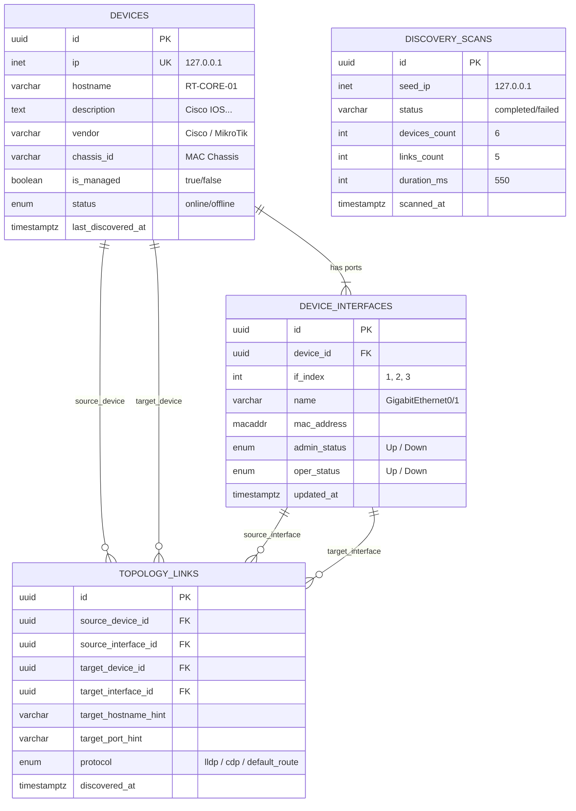

# 📡 Database Schema: 04_Network Discovery

> **Path**: `Database Design/04_Network Discovery/`  
> **DBML**: [`network_discovery.dbml`](./network_discovery.dbml)  
> **Feature Link**: [`Feature Design/04_Network Discrovery(Tee)`](../../Feature%20Design/04_Network%20Discrovery(Tee)/)  
>
> 📁 **SQL Schemas (`sql/`)**:
> - [`00_enums.sql`](./sql/00_enums.sql) (Enums & Extensions)
> - [`01_devices.sql`](./sql/01_devices.sql) (ตาราง devices)
> - [`02_device_interfaces.sql`](./sql/02_device_interfaces.sql) (ตาราง device_interfaces)
> - [`03_topology_links.sql`](./sql/03_topology_links.sql) (ตาราง topology_links)
> - [`04_discovery_scans.sql`](./sql/04_discovery_scans.sql) (ตาราง discovery_scans)
> - [`99_seed_data.sql`](./sql/99_seed_data.sql) (ข้อมูล Mock Test Data)

---

## 1. Entity-Relationship Diagram (ERD)

---

## 2. การจับคู่ 1:1 กับ Output ของ Oxian Engine

| Database Table & Column | Oxian Python Model | คำอธิบาย |
| :--- | :--- | :--- |
| **`devices.ip`** | `Device.ip` | IP Address ของอุปกรณ์ (Unique) |
| **`devices.hostname`** | `Device.hostname` | ชื่อ Hostname จาก SNMP `sysName` |
| **`devices.description`** | `Device.description` | ข้อมูล OS และ Firmware จาก `sysDescr` |
| **`devices.vendor`** | `Device.vendor` | ยี่ห้อที่ Detect อัตโนมัติ (`Cisco`, `MikroTik`, `Juniper`, `Unknown`) |
| **`devices.chassis_id`** | `Device.chassis_id` | Chassis MAC หรือ ID จาก LLDP |
| **`devices.is_managed`** | `Device.is_managed` | `true` (SNMP Managed) / `false` (Unmanaged Neighbor หรือ Default Gateway) |
| **`device_interfaces.if_index`** | `Interface.index` | หมายเลข Index พอร์ต (`ifIndex`) |
| **`device_interfaces.name`** | `Interface.description` | ชื่อพอร์ต (เช่น `GigabitEthernet0/1`, `ether1`) |
| **`device_interfaces.mac_address`** | `Interface.mac_address` | MAC Address ของพอร์ต |
| **`device_interfaces.admin_status`** | `Interface.admin_status` | สถานะพอร์ต (`Up`, `Down`, `Testing`, `Unknown`) |
| **`topology_links.source_device_id`** | `Link.source_ip` (FK resolved) | อุปกรณ์ต้นทาง |
| **`topology_links.source_interface_id`** | `Link.source_interface` (FK resolved) | พอร์ตต้นทาง |
| **`topology_links.target_device_id`** | `Link.target_ip` (FK resolved) | อุปกรณ์ปลายทาง |
| **`topology_links.target_interface_id`** | `Link.target_port_id` (FK resolved) | พอร์ตปลายทาง |
| **`topology_links.target_hostname_hint`**| `Link.target_hostname` | ชื่อ Hostname ปลายทาง (สำหรับ Unmanaged) |
| **`topology_links.target_port_hint`** | `Link.target_port_description` | ชื่อพอร์ตปลายทาง |
| **`topology_links.protocol`** | `Link.target_port_id` hint | โปรโตคอลที่พบ (`lldp`, `cdp`, `default_route`) |
