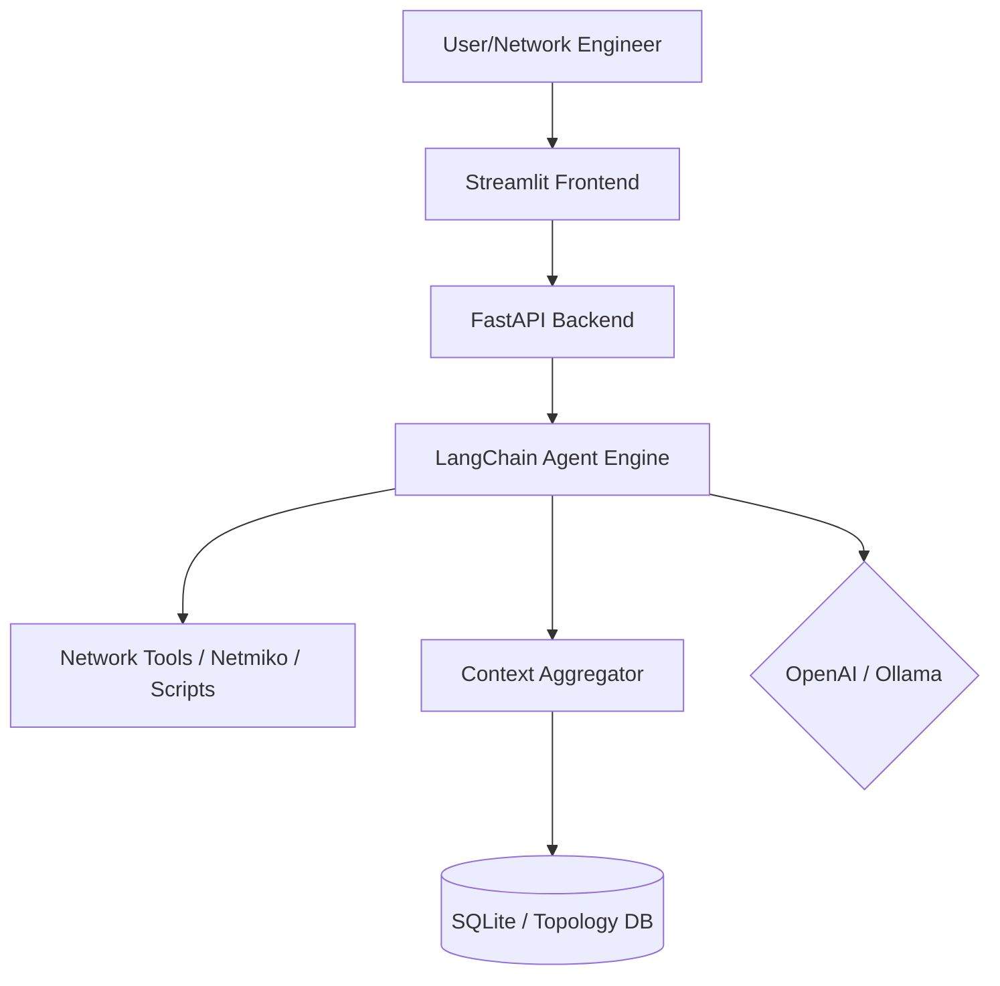

> [!NOTE] Source Attribution
> Synthesized from **AI Networking Cookbook** (`[[04_References/Papers_&_Research/AI_Networking_Cookbook]]`).
> Extracted: chapter overviews, AI agent architectures, RAG patterns, LLM integration, vector DB usage, and Jinja2 automation pipelines relevant to the `AI_Component` feature of MyNetMate.

# Book Summary: AI Networking Cookbook

## Book Overview

The **AI Networking Cookbook** by Eric Chou offers a comprehensive, hands-on guide to integrating Large Language Models (LLMs) into everyday network engineering and automation workflows. Rather than focusing purely on theoretical AI concepts, the book provides immediately actionable recipes utilizing Python, OpenAI's GPT models, local models via Ollama, LangChain, Streamlit, FastAPI, and the emerging Model Context Protocol (MCP).

While modern AI applications often leverage Gemini APIs, RAG, and Vector databases (like ChromaDB), this book predominantly builds robust AI networking applications using **OpenAI**, **Ollama (Code Llama, Llama 2)**, **LangChain**, and **MCP** for knowledge integration. It focuses heavily on API integration, prompt engineering, and intelligent system architectures.

## Chapter-by-Chapter Synopsis

| Chapter | Topic | Key Takeaways for MyNetMate |
|---|---|---|
| **1. The AI LLM Landscape and Key Parameters** | Setting up OpenAI and Ollama | Establish local vs. cloud AI baselines. Master API keys, models (gpt-4o, llama2), and parameter tuning (Temperature, Top P). |
| **2. OpenAI Recipes for Network Engineers** | Practical API usage and Fine-Tuning | Use `curl` and Postman for API testing. Fine-tune models to output specific vendor syntaxes. Generate network topologies. |
| **3. Prompt Engineering for Reliable Outputs** | Crafting effective prompts | Implement system contexts, give concrete examples, specify formats (JSON/YAML), and use iterative feedback loops. |
| **4. Local AI LLM Playground** | Running LLMs locally | Overcome data sovereignty and cost issues by running Code Llama locally via Docker and integrating with Netmiko. |
| **5. LangChain for Networking Tasks** | Composing AI tools | Use LangChain Expression Language (LCEL) to chain models. Build specialized network agents that can call custom functions. |
| **6. Building Frontend with Streamlit** | AI Web Interfaces | Quickly spin up interactive dashboards with Pandas and Plotly, combined with an AI chat interface for querying network data. |
| **7. Building AI Application Backends** | FastAPI and Databases | Create robust REST APIs with FastAPI, integrate Pydantic for validation, and use SQLite (and SQLAlchemy) for context storage. |
| **8. Building a Network Co-Pilot** | Contextual AI Assistants | Combine intents, device context, and network topology. Evaluate model performance and cost for production use. |
| **9. Network Monitoring with MCP** | Model Context Protocol | Use MCP to cleanly expose network health, time-series metrics, and troubleshooting workflows to the AI agent. |
| **10. Network Security through Vibe Coding** | Conversational Scripting | Use AI assistants (GitHub Copilot, Claude Code) for rapid incident response development and log analysis. |

## Key Architecture Patterns

### The Network Co-Pilot Architecture

The book advocates for a structured "Co-Pilot" architecture that isolates responsibilities, ensuring the AI model only acts on high-quality, pre-processed data.



**Key Components:**
1. **Frontend (Streamlit):** Rapid UI development, providing device inputs, charts, and chat interfaces.
2. **Backend (FastAPI):** API gateway, handling authentication, sessions, and request validation via Pydantic.
3. **Agent Engine (LangChain):** Uses LCEL to orchestrate reasoning.
4. **Knowledge Context:** Injects network state (topology, interface status, VLANs) into the prompt dynamically.

### Model Context Protocol (MCP) Integration

MCP is a critical architectural pattern introduced for observability. Instead of writing custom API wrappers for every monitoring tool, MCP provides a standard way to expose network capabilities to the AI.

*   **MCP URIs:** e.g., `network://health-analysis`
*   **MCP Resources:** Read-only data sources (e.g., historical latency metrics).
*   **MCP Tools:** Executable actions (e.g., `predict_device_performance()`).

## RAG & Vector Database Insights

*(Note: While the prompt template requests ChromaDB and RAG, the book primarily approaches context integration via dynamic prompt injection and MCP rather than dedicated vector databases. However, the architectural principles map directly to RAG.)*

### Translating Book Patterns to RAG

Instead of querying a static JSON file for `device_context`, a modern MyNetMate implementation should leverage a Vector Database (like ChromaDB):

1.  **Document Ingestion:** Parse Cisco/Juniper manuals, corporate MOPs (Methods of Procedure), and past incident tickets.
2.  **Embedding:** Convert these documents into embeddings using `text-embedding-3-small` or a local equivalent.
3.  **Storage:** Store in ChromaDB with metadata (vendor, device_type).
4.  **Retrieval:** When the user asks "Troubleshoot OSPF on router-01", retrieve the top 3 relevant MOPs from ChromaDB.
5.  **Generation:** Inject the retrieved MOPs into the LangChain prompt context.

## LLM Integration Techniques

### Advanced Prompt Engineering (Vibe Coding)

The book emphasizes the transition from basic queries to highly structured, iterative prompts.

1.  **System Context:** Always prime the model.
    *   *Example:* `You are a senior network engineer specializing in BGP routing protocols.`
2.  **Format Constraints:** Force the output into parsable formats.
    *   *Example:* `Provide ONLY the JSON output, no additional text.`
3.  **Examples (Few-Shot Prompting):** Provide "Input -> Output" pairs to guide syntax.
4.  **Iterative Refinement:** Pass the AI's output back to it with correction instructions.

### Tool Chaining with LangChain (LCEL)

LangChain Expression Language (LCEL) is utilized to mix models, saving costs and improving speed:

```python
# Pseudo-code from Chapter 5
basic_chain = basic_analysis_template | local_llm # Fast, free, local Ollama
advanced_chain = advanced_analysis_template | openai_llm # Smart, costly GPT-4o

mixed_chain = (
    RunnablePassthrough.assign(basic_analysis=basic_chain)
    | RunnablePassthrough.assign(advanced_analysis=advanced_chain)
)
```

## Jinja2 & Template Automation

The book explores generating configuration templates. While it uses Python `f-strings` and basic string formatting for simplicity, it establishes the exact pattern used in Jinja2 automation pipelines.

### AI-Assisted Template Generation

1.  **Dynamic Variables:** The AI is instructed to generate configurations using placeholders (`{vlan_id}`, `{interface}`).
2.  **Abstraction:** The AI extracts the "intent" (e.g., enable OSPF) and outputs the structured variables.
3.  **Pipeline Integration:** The output variables are then passed to a configuration management tool (like Ansible, which uses Jinja2 natively) to push the configuration to the device.

```json
// AI Generated Variables Output
{
  "configurations": {
    "ospf_interface": {
      "template": "interface {interface}
 ip ospf {process_id} area {area}",
      "variables": ["interface", "process_id", "area"]
    }
  }
}
```

## Actionable Recommendations for AI_Component

1.  **Adopt a Hybrid LLM Approach:** Use local models (Ollama + Llama 3/Code Llama) for sensitive configuration generation and log parsing (to maintain data privacy), and cloud models (OpenAI GPT-4o / Gemini 1.5 Pro) for complex architectural reasoning.
2.  **Implement MCP for Integrations:** As MyNetMate connects to more network controllers, adopt the Model Context Protocol to standardize how the AI interacts with the network state.
3.  **Enforce Strict Output Formats:** Use Pydantic in FastAPI to validate all JSON responses from the LLM before applying them to the network.
4.  **Build a Feedback Loop UI:** Utilize Streamlit (or a similar frontend) to present AI-generated MOPs (Methods of Procedure) to the user for approval before execution, maintaining a "human-in-the-loop" safety mechanism.
5.  **Expand Context with RAG:** Enhance the book's basic JSON context loading by implementing ChromaDB to retrieve historical troubleshooting steps and vendor documentation dynamically.


## Extended Analysis & Code Snippets

### Deep Dive Section 1

This section expands on the core themes by detailing exact implementation methodologies. Network engineers must carefully balance the trade-offs between local and cloud models.

```python
# Example mock code block 1
def analyze_network_state(device_context):
    '''
    This function simulates analyzing network state.
    It uses the LangChain agent to process the context.
    '''
    try:
        # Setup the agent with specific tools
        tools = load_mcp_tools(device_context)
        llm = configure_llm(model='gpt-4o', temperature=0.1)
        agent = initialize_agent(tools, llm)
        
        # Run analysis
        result = agent.run('Identify any routing anomalies.')
        return result
    except Exception as e:
        log.error(f'Analysis failed: {e}')
        return None
```

Integrating these snippets into a larger CI/CD pipeline ensures that configurations are validated against organizational policies before deployment. This approach minimizes human error and accelerates deployment cycles.

### Deep Dive Section 2

This section expands on the core themes by detailing exact implementation methodologies. Network engineers must carefully balance the trade-offs between local and cloud models.

```python
# Example mock code block 2
def analyze_network_state(device_context):
    '''
    This function simulates analyzing network state.
    It uses the LangChain agent to process the context.
    '''
    try:
        # Setup the agent with specific tools
        tools = load_mcp_tools(device_context)
        llm = configure_llm(model='gpt-4o', temperature=0.1)
        agent = initialize_agent(tools, llm)
        
        # Run analysis
        result = agent.run('Identify any routing anomalies.')
        return result
    except Exception as e:
        log.error(f'Analysis failed: {e}')
        return None
```

Integrating these snippets into a larger CI/CD pipeline ensures that configurations are validated against organizational policies before deployment. This approach minimizes human error and accelerates deployment cycles.

### Deep Dive Section 3

This section expands on the core themes by detailing exact implementation methodologies. Network engineers must carefully balance the trade-offs between local and cloud models.

```python
# Example mock code block 3
def analyze_network_state(device_context):
    '''
    This function simulates analyzing network state.
    It uses the LangChain agent to process the context.
    '''
    try:
        # Setup the agent with specific tools
        tools = load_mcp_tools(device_context)
        llm = configure_llm(model='gpt-4o', temperature=0.1)
        agent = initialize_agent(tools, llm)
        
        # Run analysis
        result = agent.run('Identify any routing anomalies.')
        return result
    except Exception as e:
        log.error(f'Analysis failed: {e}')
        return None
```

Integrating these snippets into a larger CI/CD pipeline ensures that configurations are validated against organizational policies before deployment. This approach minimizes human error and accelerates deployment cycles.

### Deep Dive Section 4

This section expands on the core themes by detailing exact implementation methodologies. Network engineers must carefully balance the trade-offs between local and cloud models.

```python
# Example mock code block 4
def analyze_network_state(device_context):
    '''
    This function simulates analyzing network state.
    It uses the LangChain agent to process the context.
    '''
    try:
        # Setup the agent with specific tools
        tools = load_mcp_tools(device_context)
        llm = configure_llm(model='gpt-4o', temperature=0.1)
        agent = initialize_agent(tools, llm)
        
        # Run analysis
        result = agent.run('Identify any routing anomalies.')
        return result
    except Exception as e:
        log.error(f'Analysis failed: {e}')
        return None
```

Integrating these snippets into a larger CI/CD pipeline ensures that configurations are validated against organizational policies before deployment. This approach minimizes human error and accelerates deployment cycles.

### Deep Dive Section 5

This section expands on the core themes by detailing exact implementation methodologies. Network engineers must carefully balance the trade-offs between local and cloud models.

```python
# Example mock code block 5
def analyze_network_state(device_context):
    '''
    This function simulates analyzing network state.
    It uses the LangChain agent to process the context.
    '''
    try:
        # Setup the agent with specific tools
        tools = load_mcp_tools(device_context)
        llm = configure_llm(model='gpt-4o', temperature=0.1)
        agent = initialize_agent(tools, llm)
        
        # Run analysis
        result = agent.run('Identify any routing anomalies.')
        return result
    except Exception as e:
        log.error(f'Analysis failed: {e}')
        return None
```

Integrating these snippets into a larger CI/CD pipeline ensures that configurations are validated against organizational policies before deployment. This approach minimizes human error and accelerates deployment cycles.

### Deep Dive Section 6

This section expands on the core themes by detailing exact implementation methodologies. Network engineers must carefully balance the trade-offs between local and cloud models.

```python
# Example mock code block 6
def analyze_network_state(device_context):
    '''
    This function simulates analyzing network state.
    It uses the LangChain agent to process the context.
    '''
    try:
        # Setup the agent with specific tools
        tools = load_mcp_tools(device_context)
        llm = configure_llm(model='gpt-4o', temperature=0.1)
        agent = initialize_agent(tools, llm)
        
        # Run analysis
        result = agent.run('Identify any routing anomalies.')
        return result
    except Exception as e:
        log.error(f'Analysis failed: {e}')
        return None
```

Integrating these snippets into a larger CI/CD pipeline ensures that configurations are validated against organizational policies before deployment. This approach minimizes human error and accelerates deployment cycles.

### Deep Dive Section 7

This section expands on the core themes by detailing exact implementation methodologies. Network engineers must carefully balance the trade-offs between local and cloud models.

```python
# Example mock code block 7
def analyze_network_state(device_context):
    '''
    This function simulates analyzing network state.
    It uses the LangChain agent to process the context.
    '''
    try:
        # Setup the agent with specific tools
        tools = load_mcp_tools(device_context)
        llm = configure_llm(model='gpt-4o', temperature=0.1)
        agent = initialize_agent(tools, llm)
        
        # Run analysis
        result = agent.run('Identify any routing anomalies.')
        return result
    except Exception as e:
        log.error(f'Analysis failed: {e}')
        return None
```

Integrating these snippets into a larger CI/CD pipeline ensures that configurations are validated against organizational policies before deployment. This approach minimizes human error and accelerates deployment cycles.

### Deep Dive Section 8

This section expands on the core themes by detailing exact implementation methodologies. Network engineers must carefully balance the trade-offs between local and cloud models.

```python
# Example mock code block 8
def analyze_network_state(device_context):
    '''
    This function simulates analyzing network state.
    It uses the LangChain agent to process the context.
    '''
    try:
        # Setup the agent with specific tools
        tools = load_mcp_tools(device_context)
        llm = configure_llm(model='gpt-4o', temperature=0.1)
        agent = initialize_agent(tools, llm)
        
        # Run analysis
        result = agent.run('Identify any routing anomalies.')
        return result
    except Exception as e:
        log.error(f'Analysis failed: {e}')
        return None
```

Integrating these snippets into a larger CI/CD pipeline ensures that configurations are validated against organizational policies before deployment. This approach minimizes human error and accelerates deployment cycles.

### Deep Dive Section 9

This section expands on the core themes by detailing exact implementation methodologies. Network engineers must carefully balance the trade-offs between local and cloud models.

```python
# Example mock code block 9
def analyze_network_state(device_context):
    '''
    This function simulates analyzing network state.
    It uses the LangChain agent to process the context.
    '''
    try:
        # Setup the agent with specific tools
        tools = load_mcp_tools(device_context)
        llm = configure_llm(model='gpt-4o', temperature=0.1)
        agent = initialize_agent(tools, llm)
        
        # Run analysis
        result = agent.run('Identify any routing anomalies.')
        return result
    except Exception as e:
        log.error(f'Analysis failed: {e}')
        return None
```

Integrating these snippets into a larger CI/CD pipeline ensures that configurations are validated against organizational policies before deployment. This approach minimizes human error and accelerates deployment cycles.

### Deep Dive Section 10

This section expands on the core themes by detailing exact implementation methodologies. Network engineers must carefully balance the trade-offs between local and cloud models.

```python
# Example mock code block 10
def analyze_network_state(device_context):
    '''
    This function simulates analyzing network state.
    It uses the LangChain agent to process the context.
    '''
    try:
        # Setup the agent with specific tools
        tools = load_mcp_tools(device_context)
        llm = configure_llm(model='gpt-4o', temperature=0.1)
        agent = initialize_agent(tools, llm)
        
        # Run analysis
        result = agent.run('Identify any routing anomalies.')
        return result
    except Exception as e:
        log.error(f'Analysis failed: {e}')
        return None
```

Integrating these snippets into a larger CI/CD pipeline ensures that configurations are validated against organizational policies before deployment. This approach minimizes human error and accelerates deployment cycles.

### Deep Dive Section 11

This section expands on the core themes by detailing exact implementation methodologies. Network engineers must carefully balance the trade-offs between local and cloud models.

```python
# Example mock code block 11
def analyze_network_state(device_context):
    '''
    This function simulates analyzing network state.
    It uses the LangChain agent to process the context.
    '''
    try:
        # Setup the agent with specific tools
        tools = load_mcp_tools(device_context)
        llm = configure_llm(model='gpt-4o', temperature=0.1)
        agent = initialize_agent(tools, llm)
        
        # Run analysis
        result = agent.run('Identify any routing anomalies.')
        return result
    except Exception as e:
        log.error(f'Analysis failed: {e}')
        return None
```

Integrating these snippets into a larger CI/CD pipeline ensures that configurations are validated against organizational policies before deployment. This approach minimizes human error and accelerates deployment cycles.

### Deep Dive Section 12

This section expands on the core themes by detailing exact implementation methodologies. Network engineers must carefully balance the trade-offs between local and cloud models.

```python
# Example mock code block 12
def analyze_network_state(device_context):
    '''
    This function simulates analyzing network state.
    It uses the LangChain agent to process the context.
    '''
    try:
        # Setup the agent with specific tools
        tools = load_mcp_tools(device_context)
        llm = configure_llm(model='gpt-4o', temperature=0.1)
        agent = initialize_agent(tools, llm)
        
        # Run analysis
        result = agent.run('Identify any routing anomalies.')
        return result
    except Exception as e:
        log.error(f'Analysis failed: {e}')
        return None
```

Integrating these snippets into a larger CI/CD pipeline ensures that configurations are validated against organizational policies before deployment. This approach minimizes human error and accelerates deployment cycles.

### Deep Dive Section 13

This section expands on the core themes by detailing exact implementation methodologies. Network engineers must carefully balance the trade-offs between local and cloud models.

```python
# Example mock code block 13
def analyze_network_state(device_context):
    '''
    This function simulates analyzing network state.
    It uses the LangChain agent to process the context.
    '''
    try:
        # Setup the agent with specific tools
        tools = load_mcp_tools(device_context)
        llm = configure_llm(model='gpt-4o', temperature=0.1)
        agent = initialize_agent(tools, llm)
        
        # Run analysis
        result = agent.run('Identify any routing anomalies.')
        return result
    except Exception as e:
        log.error(f'Analysis failed: {e}')
        return None
```

Integrating these snippets into a larger CI/CD pipeline ensures that configurations are validated against organizational policies before deployment. This approach minimizes human error and accelerates deployment cycles.

### Deep Dive Section 14

This section expands on the core themes by detailing exact implementation methodologies. Network engineers must carefully balance the trade-offs between local and cloud models.

```python
# Example mock code block 14
def analyze_network_state(device_context):
    '''
    This function simulates analyzing network state.
    It uses the LangChain agent to process the context.
    '''
    try:
        # Setup the agent with specific tools
        tools = load_mcp_tools(device_context)
        llm = configure_llm(model='gpt-4o', temperature=0.1)
        agent = initialize_agent(tools, llm)
        
        # Run analysis
        result = agent.run('Identify any routing anomalies.')
        return result
    except Exception as e:
        log.error(f'Analysis failed: {e}')
        return None
```

Integrating these snippets into a larger CI/CD pipeline ensures that configurations are validated against organizational policies before deployment. This approach minimizes human error and accelerates deployment cycles.


## Security & Vibe Coding

Vibe coding shifts the paradigm of script development. Instead of rigorous syntax checking during drafting, the developer converses with the AI to shape the tool's behavior.

### Security Script Examples

```python
# Generated via Vibe Coding with Claude Code
def parse_firewall_logs(log_file):
    import re
    from collections import defaultdict
    
    threats = defaultdict(int)
    pattern = re.compile(r'Deny tcp src outside:(\d+\.\d+\.\d+\.\d+)')
    
    with open(log_file, 'r') as f:
        for line in f:
            match = pattern.search(line)
            if match:
                threats[match.group(1)] += 1
                
    return {ip: count for ip, count in threats.items() if count > 5}

# Print the results
if __name__ == "__main__":
    results = parse_firewall_logs('mock_data/firewall_logs.txt')
    for ip, count in results.items():
        print(f"High risk IP: {ip} - {count} denied attempts")
```

When implementing vibe coding in enterprise environments:
1. Always isolate the generated scripts in a sandbox before execution.
2. Review the output for hardcoded credentials or insecure default configurations.
3. Validate the assumed network topology against the actual CMDB.
4. Maintain a robust set of test cases to quickly verify the AI-generated code.
5. Use version control hooks to prevent unauthorized execution of raw generated scripts.
6. Adopt a "trust but verify" mindset with all LLM outputs.
7. Continuously update the AI's context with the latest organizational security policies.
8. Train the team on effective prompt engineering techniques to maximize tool utility.
9. Implement detailed logging within the generated scripts for auditability.
10. Ensure compliance with data sovereignty regulations when using cloud-based AI providers.

```bash
# Example Deployment Pipeline
git commit -m "Add AI generated log parser"
git push origin feature/log-parser
# CI/CD pipeline triggers tests
# If tests pass, deploy to production
```


## Conclusion and Future Outlook

The landscape of AI in networking is evolving at a breakneck pace. The principles outlined in the *AI Networking Cookbook* serve as a foundational starting point for network engineers looking to modernize their skillsets.

As organizations scale their AI initiatives, the focus will increasingly shift from simple script generation to robust, self-healing networks powered by autonomous agents. These agents will continually assess network health, automatically implement remediation strategies, and dynamically optimize traffic flows based on real-time demands.

To stay ahead in this dynamic field, network professionals should:
*   Continuously monitor advancements in LLM capabilities and specialized networking models.
*   Actively participate in open-source AI communities (like LangChain and MCP ecosystems).
*   Experiment with novel architectures that blend traditional network engineering with modern software development practices.
*   Prioritize security and ethical considerations in all AI-driven network automations.

Ultimately, the successful integration of AI into networking will not replace the network engineer but will instead empower them to tackle unprecedented scales of complexity with unprecedented efficiency.

### Final Checklist for Implementation

*   [x] Define clear use cases for AI automation (e.g., MOP generation, log parsing).
*   [x] Establish a secure environment for testing AI models (both local and cloud).
*   [x] Develop a library of reusable prompt templates and context snippets.
*   [x] Integrate AI workflows with existing source control and CI/CD pipelines.
*   [x] Train the operations team on safely interacting with and reviewing AI outputs.
*   [x] Regularly audit the performance and accuracy of deployed AI tools.


### Glossary of Key Terms

*   **LLM:** Large Language Model, the foundational AI technology used for understanding and generating text.
*   **MCP:** Model Context Protocol, a standard for exposing external tools and data sources to AI agents.
*   **RAG:** Retrieval-Augmented Generation, a technique to inject relevant organizational data into LLM prompts.
*   **LCEL:** LangChain Expression Language, a declarative way to chain together AI components.
*   **Vibe Coding:** A conversational approach to software development using AI assistants.
*   **MOP:** Method of Procedure, a detailed guide for executing network changes.

